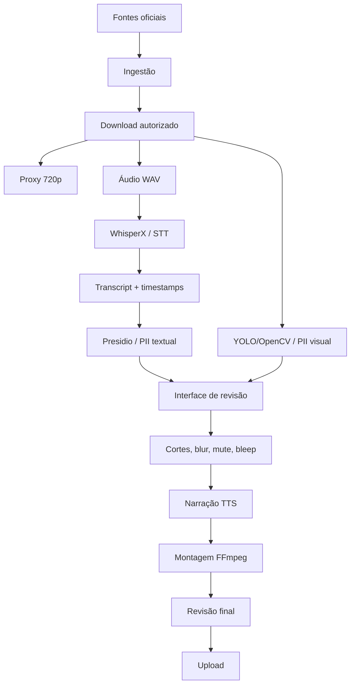

# Sumário — Pipeline local para vídeos públicos de abordagens policiais

## 1. Propósito

Este documento resume a arquitetura proposta para uma pipeline local de produção de vídeos longos, com foco em material público de abordagens policiais, câmeras corporais, dashcams e briefings oficiais. A intenção é transformar gravações públicas em vídeos educativos e comentados, com curadoria, contexto, censura de dados sensíveis e baixo nível de violência explícita.

O objetivo não é republicar gravações brutas. O objetivo é criar um fluxo de trabalho transformativo, com análise, narração, cortes, explicações, legendas, capítulos, anonimização e revisão editorial.

## 2. Premissas editoriais

A pipeline deve seguir quatro regras centrais:

1. Utilizar fontes oficiais ou legalmente obtidas.
2. Evitar conteúdo gráfico, chocante ou sensacionalista.
3. Redigir dados pessoais e proteger terceiros.
4. Manter revisão humana antes da publicação.

A automação deve acelerar triagem, transcrição, marcação e renderização. Ela não substitui decisão editorial, revisão legal, revisão de privacidade e avaliação de políticas da plataforma.

## 3. Hardware alvo

Configuração considerada:

| Componente | Especificação |
|---|---|
| CPU | AMD Ryzen 7 5700X3D |
| RAM | 32 GB |
| GPU | RTX 3080 12 GB |
| Armazenamento | SSD/NVMe recomendado |
| Sistema | Linux ou Windows/WSL2 |

Essa configuração é suficiente para a pipeline inicial. A GPU permite transcrição acelerada, detecção visual, blur e renderização via NVENC. A RAM de 32 GB é suficiente para operar o pipeline com uma execução por vez. Para paralelismo mais agressivo, o ideal seria 64 GB ou mais.

## 4. Arquitetura resumida

Fluxo geral:



## 5. Componentes principais

### 5.1 Orquestração

Ferramenta principal recomendada: **Prefect**.

Motivo: o fluxo é naturalmente dividido em tarefas Python, com etapas longas, falhas possíveis, retries e estado persistente. Prefect permite transformar cada etapa em tarefa rastreável.

Uso proposto:

- Agendar buscas e ingestões.
- Executar transcrição.
- Gerar arquivos intermediários.
- Encadear detecção de PII.
- Pausar para revisão humana.
- Retomar renderização final.

Node-RED pode ser usado como camada auxiliar visual, principalmente para botões, webhooks, dashboards simples e gatilhos manuais.

### 5.2 Download e ingestão

Ferramenta principal: **yt-dlp**.

Uso recomendado apenas quando houver permissão, licença adequada ou fonte pública compatível com reutilização. Para operações manuais, uma GUI como YNOT pode facilitar testes.

Saídas esperadas:

- Vídeo bruto.
- Metadados da fonte.
- Legendas originais, quando existirem.
- Thumbnail original, quando permitido.
- Registro de origem e data.

### 5.3 Transcrição

Ferramenta principal: **WhisperX**.

Motivos:

- Timestamps por palavra.
- Diarização de falantes.
- Boa qualidade em inglês.
- Execução local com GPU.

Saídas esperadas:

- Transcript em JSON.
- Legendas SRT.
- Segmentos por falante.
- Mapa palavra-tempo.

### 5.4 Detecção textual de PII

Ferramenta principal: **Microsoft Presidio**.

Uso:

- Detectar nomes.
- Detectar endereços.
- Detectar telefones.
- Detectar IDs e números sensíveis.
- Gerar marcações para mutar áudio e ocultar legenda.

Presidio deve ser usado como pré-filtro. A revisão humana é obrigatória.

### 5.5 Detecção visual de PII

Ferramentas recomendadas:

- YOLO para rostos, placas e objetos sensíveis.
- OpenCV/YuNet como detector leve adicional.
- FFmpeg para aplicar blur, pixelização, tarjas e cortes.

Saídas esperadas:

- Lista de caixas por frame.
- Máscaras temporais.
- Preview com blur.
- Relatório de confiança.

### 5.6 Narração

Modelos recomendados:

- Kokoro TTS para narração leve, natural e permissiva.
- Piper como fallback extremamente leve.
- Fish Speech ou outro modelo permissivo caso seja necessária voz mais expressiva.

Evitar clonagem de voz sem autorização explícita.

### 5.7 Montagem e renderização

Ferramenta principal: **FFmpeg**.

Responsabilidades:

- Cortes.
- Mute/bleep.
- Blur e pixelização.
- Inserção de legendas.
- Mixagem com narração.
- Renderização final.
- Geração de proxies.

A RTX 3080 deve ser usada para encode com NVENC.

## 6. Estrutura recomendada de diretórios

```text
project-root/
├─ docs/
│  └─ video-pipeline/
├─ data/
│  ├─ sources/
│  ├─ raw/
│  ├─ proxy/
│  ├─ audio/
│  ├─ transcripts/
│  ├─ pii/
│  ├─ masks/
│  ├─ reviewed/
│  └─ output/
├─ flows/
├─ scripts/
├─ ui/
├─ config/
└─ logs/
```

## 7. Papéis do operador

O operador humano continua responsável por:

1. Escolher fontes adequadas.
2. Verificar direitos de uso.
3. Revisar violência explícita.
4. Revisar dados pessoais.
5. Corrigir transcript.
6. Aprovar cortes e blur.
7. Validar roteiro e narração.
8. Aprovar upload final.

A IA e as automações auxiliam na triagem e produção, mas não devem publicar sem revisão.

## 8. Critérios de publicação

Um vídeo só deve seguir para publicação se cumprir:

- Fonte registrada.
- Contexto preservado.
- PII revisado.
- Rostos e placas protegidos quando necessário.
- Linguagem ofensiva tratada, se aplicável.
- Violência gráfica removida ou censurada.
- Narração transformativa incluída.
- Descrição com fonte e contexto.
- Legendas revisadas.
- Miniatura não sensacionalista.

## 9. Escopo inicial

MVP recomendado:

1. Ingestão manual com registro de fonte.
2. Transcrição WhisperX.
3. Detecção textual Presidio.
4. Blur automático de rostos e placas.
5. Interface simples de revisão.
6. Renderização final por FFmpeg.
7. Upload manual.

A automação de upload deve vir depois, quando a etapa editorial já estiver madura.

## 10. Próximos documentos

Este sumário é complementado por:

- `01-tutorial-passo-a-passo.md`: execução detalhada da pipeline.
- `02-planejamento.md`: roadmap, fases, riscos e backlog técnico.
